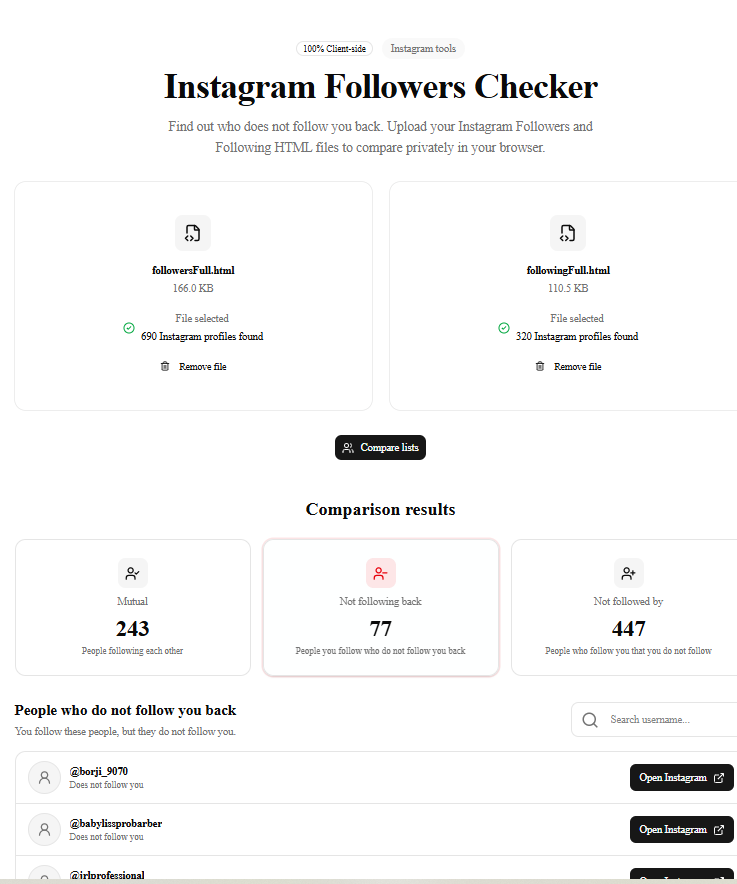
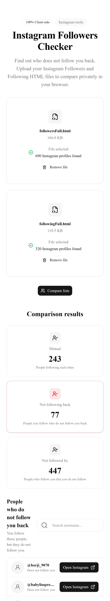

# Instagram Followers Checker

A lightweight client-side tool to compare your Instagram Followers and Following HTML exports and find out who doesn't follow you back.

**Privacy-first:** All processing happens locally in the browser — no uploads, no backend, no Instagram credentials required.

## Features

- Upload Instagram `followers.html` and `following.html` exports
- Parse Instagram profile links in-browser using DOM parsing
- Show counts for Mutual, Not following back, and Not followed by
- Search and filter the resulting lists
- Open Instagram profiles directly from the results
- Responsive, accessible, and modern UI (Tailwind + shadcn)

## Tech Stack

- Next.js (App Router)
- React + TypeScript
- Tailwind CSS
- shadcn/ui components
- Lucide Icons

## How it works

1. Export your Instagram data (Followers / Following) from Instagram
2. Upload the two HTML files in the browser
3. The app parses anchors and extracts usernames locally
4. Compare Followers vs Following to produce lists and statistics

## Privacy

All files are processed locally in your browser. Nothing is uploaded or stored on any server. No Instagram credentials are required.

## Installation

```bash
npm install
npm run dev
```

Open http://localhost:3000 in your browser.

## Usage

1. Export Instagram data (Settings → Privacy → Account Data → Download or use Instagram export flow)
2. Upload `followers.html` using the Followers card
3. Upload `following.html` using the Following card
4. Click **Compare lists**
5. Review the `Not following back` list and use the search to find users

## Development approach

This project was developed with an AI-assisted live coding workflow: a developer and AI collaborated on architecture, implementation, styling, and testing. The developer guided decisions, reviewed generated code, and verified functionality.

## Screenshots

### Desktop



### Mobile



> Placeholders above — add real screenshots into `./screenshots/` before publishing.

## Future improvements

- Add CSV / JSON export of results
- Add multi-account support (client-side only)
- Add keyboard shortcuts and bulk actions

## Contributing

This repository is prepared for demonstration and freelance presentations. If you contribute, please run TypeScript checks and linting before opening PRs.

---

If you want, I can also create the `screenshots/` folder and capture example layouts (placeholder images).
